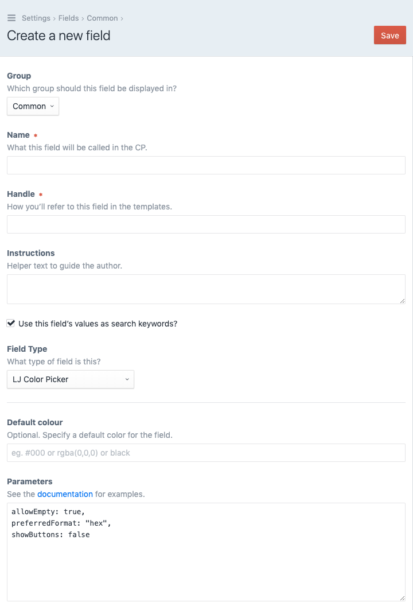
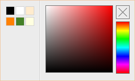
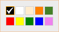
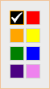

# LJ Color Picker plugin for Craft CMS 3.x

A simple color picker for Craft CMS based on the [jQuery Spectrum plugin](https://github.com/bgrins/spectrum).

## Requirements

This plugin requires Craft CMS 3.0.0 or later.

## Installation

You can install the plugin via the Craft Plugin Store.

## Overview

This plugin adds the following fieldtype:

- LJ Color Picker

## Screenshot



## Quick start

The default behaviour is to display a mini-picker that shows the currently selected color. For example:


Clicking on the mini-picker shows the full interface. You can embed the full interface directly into the page with `flat: true`.

## Examples

Copy one of the following examples into the Parameters field above.

### Simple example


```
allowEmpty: true,
preferredFormat: "hex",
showButtons: false
```

### Show input


```
allowEmpty: true,
preferredFormat: "hex",
showButtons: false,
showInput: true
```

### Show alpha


```
allowEmpty: true,
preferredFormat: "rgb",
showButtons: false,
showInput: true,
showAlpha: true
```

### Show palette



```
allowEmpty: true,
showButtons: false,
showPalette: true,
palette: [
    ['black', 'white', 'blanchedalmond'],
    ['rgb(255, 128, 0);', 'hsv 100 70 50', 'lightyellow']
]
```

### Show palette only



```
showPaletteOnly: true,
showPalette:true,
palette: [
    ['black', 'white', 'blanchedalmond',
    'rgb(255, 128, 0);', 'hsv 100 70 50'],
    ['red', 'yellow', 'green', 'blue', 'violet']
]
```

### Twig logic



```


	[
	
		{{ loop.index > 1 ? ',' }}
	    [
        
        	{{ loop.index > 1 ? ',' }}
            '{{ color }}'
        
	    ]
	
	]


showPaletteOnly: true,
showPalette:true,
palette: {{ palette }}
```

### Params in an external file

(relative to /templates folder)

```

```

### More examples

See the original [jQuery Spectrum plugin](https://github.com/bgrins/spectrum) for more examples.

---

This plugin is based on the [jQuery Spectrum plugin](https://github.com/bgrins/spectrum) plugin [[MIT licence](https://github.com/bgrins/spectrum/blob/master/LICENSE)], with thanks to the original developer.

Brought to you by [Lewis Jenkins](https://lj.io).